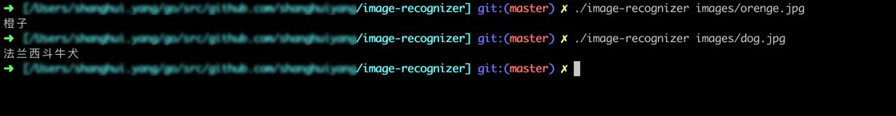

# image-recognizer
image-recognizer uses the Baidu API to implement image recognition in pure golang.

## Usage
Suppose that you have had the `AppKey` and `SecretKey` from the [Baidu AI Platform](https://ai.baidu.com). Replace `your_app_key` and `your_secret_key` with yours in main.go.
```go
// ...
const (
	// replace your_app_key and your_secret_key with yours
	appKey    = "your_app_key"
	secretKey = "your_secret_key"
)
// ...
```

build and test.
```shell
# cd to this project directory
$ go build
$ ./image-recognizer images/orenge.jpg
```


